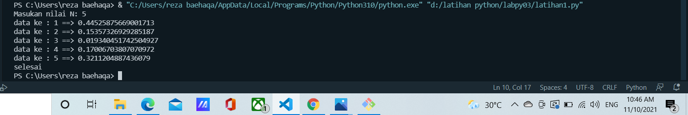
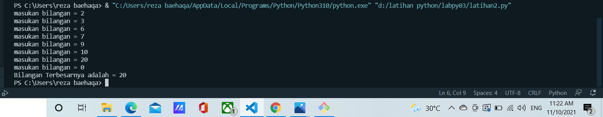
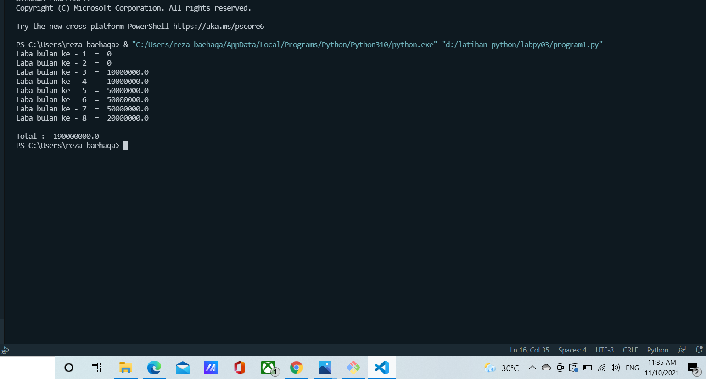

# labpy03
```sh
Nama    : A. Reza Baehaqa Jamroni
Nim     : 312110494
Matkul  : Bahasa Perograman
```
## Membuat program dengan menggunakan perulangan For dan While
Perulangan for disebut counted loop (perulangan yang terhitung), sementara perulangan while disebut uncounted loop (perulangan yang tak terhitung). Perbedaannya adalah perulangan for biasanya digunakan untuk mengulangi kode yang sudah diketahui banyak perulangannya. Sementara while untuk perulangan yang memiliki syarat dan tidak tentu berapa banyak perulangannya.

### Algoritma latihan1.py
```sh
print("masukan nilai N: 5 ")
import random

a = 5
b = 0
for i in range(a):
    i = random.uniform(.0, .5)
    b += 1
    print("data ke :", b, "==>", i)
print("selesai")
```
1. "print" : berfungsi untuk mencetak atau menampilkan objek ke perangkat keluaran (layar) atau ke file teks.
2. "import" : fungsi lanjut yang dipanggil oleh statement import.
3. "random" : untuk menentukan suatu pilihan.
 dengan penjelasan : misalkan kita ingin merandomnya cukup sekali saja, katakanlah dihasilkan bilangan riil random yaitu X. Apabila nanti function random() ini dieksekusi kembali maka akan tetap dihasilkan bilangan X yang sama.
 contoh diatas menggunakan i = random.uniform(.0, .5)
4. "range" : merupakan fungsi yang menghasilkan list. Fungsi ini akan menciptakan sebuah list baru dengan rentang nilai tertentu. 
contoh diatas range (a) 
a = 5 maka akan muncul 5 data sesuai perintah
5."uniform": digunakan untuk menampilkan bilangan float random dengan batas awal bilangan ke 1 (awal), dan batas akhir bilangan ke 5 (akhir).
6. selesai

### screenshot output program latihan1.py


### Algoritma latihan2.py
```sh
maks = 0
while True:
    b = int(input("masukan bilangan = "))
    if maks < b:
        maks = b
    if b == 0:
        break
print("Bilangan Terbesarnya adalah =", maks)
```

print (' Bilangan Terbesar Dari n Buah Data Yang Dimasukan ') max = 0 while True: x=int(input("Masukan Bilangan : ")) if max < x: max = x if x==0: break print ("Bilangan Terbesar Adalah : ", max) Penjelasan program print (' Bilangan Terbesar Dari n Buah Data Yang Dimasukan ') Untuk menampilkan kalimat Menampilkan Bilangan Terbesar Dari n Buah Data Yang Diinputkan max = 0 kode max disini untuk menentukan nilai max nya dalah 0 while True: Untuk perulangan hingga waktu yang tidak di tentukan atau selamanya x=int(input("Masukan Bilangan : ")) x untuk menginput tipe data interger ( bilangan bulat ) if max < x: jika max kurang dari x maka max = x if x==0: break jika x= 0 maka akan berhenti dengan syarat break yang terpenuhi print ("Bilangan Terbesar Adalah : ", max) Menampilkan *Bilangan Terbesar Adalah : Nilai maxiumny
### screenshot output program latihan2.py


### Algoritma program1.py
```sh
a = 100000000
for i in range(1, 9):
    if (i >= 1 and i <= 2):
        b = a * 0
        print("Laba bulan ke -", i, " = ", b)
    if (i >= 3 and i <= 4):
        c = a * 0.1
        print("Laba bulan ke -", i, " = ", c)
    if (i >= 5 and i <= 7):
        d = a * 0.5
        print("Laba bulan ke -", i, " = ", d)
    if (i == 8):
        e = a * 0.2
        print("Laba bulan ke -", i, " = ", e)
        total = b + b + c + c + d + d + d + e
        print("\nTotal : ", total)
```

ALGORITMA menghitung keuntungan selama 8 bulan berjalannya usaha :

1. Mulai
2. Mencetak latihan1
3. Mencetak "Program menghitung laba dengan modal awal 100 juta"
4. Membuat Note
5. Mencetak Bulan pertama dan kedua = 0%
6. Mencetak bulan ke 3 = 1%
7. Mencetak bulan ke 5 = 5%
8. Mencetak bulan ke 8 = 2%
9. integer a = 100.000.000( modal awal)
10. Menggunakan fungsi looping for pada nilai x 1-9 untuk menampilkan bulan 1 sampai bulan 8.
11. Menggunakan fungsi if, untuk menghitung laba bulan 1 sampai 8
12. bulan pertama dan kedua laba adalah 0
13. bulan ke 3 dan ke 4 mendapat laba 1% sehingga modal di kali 1% = keuntungan
14. bulan ke 5 mendapatkan laba 5%, sehingga modal dikali 5% = keuntungan
15. Bulan ke 8 mmendapatkan laba 2% sehingga keuntungan menurun dari bulan sebelumnya, modal dikali 2% = keuntungan.
16. Menghitung jumlah total laba dengan menjumlah keuntungan dari bulan ke 1 sampai bulan 8, hasilnya adalah total keuntungan yang didapat.
17. Selesai

### screenshot output program1.py.py
